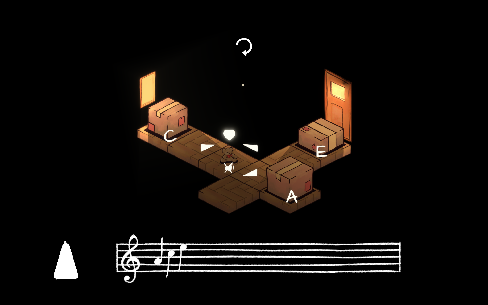

# Ode to Summer
An 8 level musical puzzle game about creating tunes!
## About

### Description
An Ode to Summer is a short 8 level demo of a musical puzzle game. Puzzles are solved by creating tunes by chaining notes together. The game is designed to be fun and engaging, while also teaching players about basic music theory. It implements a real-time lighting system in a 2D environment, mimicing 3D lighting conditions, it is designed to be aesthetically appreciated!
 
Features:

* Real-time lighting effects in a 2D environment
* Chain notes together in the correct sequence to create a melody
* Short poems about summer
* Immersive background effects and gameplay
* Solutions to puzzles provided in [Release 1.0.0](https://github.com/AustinKong/Helios/releases/tag/1.0.0)

Some info:
* Click on the pulsing heart in the main menu to start playing
* Click and drag on items to move them around the level
* The pulsing heart represents the 'origin' of notes
* Click on the metronome to make the 'origin' emit notes
* The tune to be matched is shown at the bottom of the screen

### Technology
* Unity: Game engine to run the simulation
* C#: Backend logic
## Getting Started
### Deployment
Download instructions for users (for Windows only):
1. Download [Release1.0.0.zip](https://github.com/AustinKong/Helios/releases/tag/1.0.0)
2. Unzip Release1.0.0.zip
3. Open README.png for a simple tutorial
3. Open build folder, run 'Ode to Summer.exe'
### Dependencies
* Unity
### Installation
Installation and setup instructions for developers:
1. Install Unity Hub
2. Install Unity version 2019.4.33f1 or recommended LTS
3. Fork and clone the repository
4. Start coding and build something awesome!
### Contributing
This project is no longer under active development. Suggestions, issues and bug reports will not be actively resolved. However, pull requests and forks are always welcome!
## Help
### Controls
	Alt + F4 - Quit
	Restart (top middle) - Restarts level
	Metronome (bottom left) - Emit notes from 'origin'
	
## Authors
Austin Kong [@AustinKong](https://github.com/AustinKong)
## License
This project is licensed under MIT license. View license in [license.txt](license.txt)
